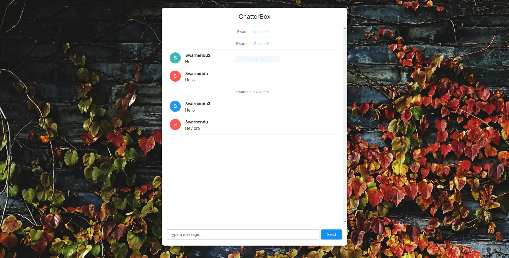

## Overview

ChatterBox is an end to end real-time text-messaging service made using websockets in Spring-Boot using Java. It enables multiple users to interact over the internet instantly.

## Screenshot

   

